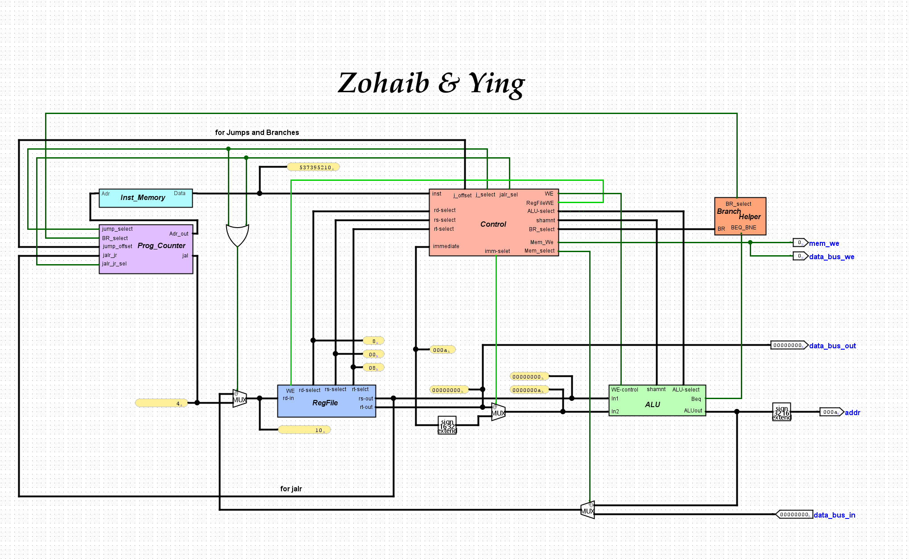
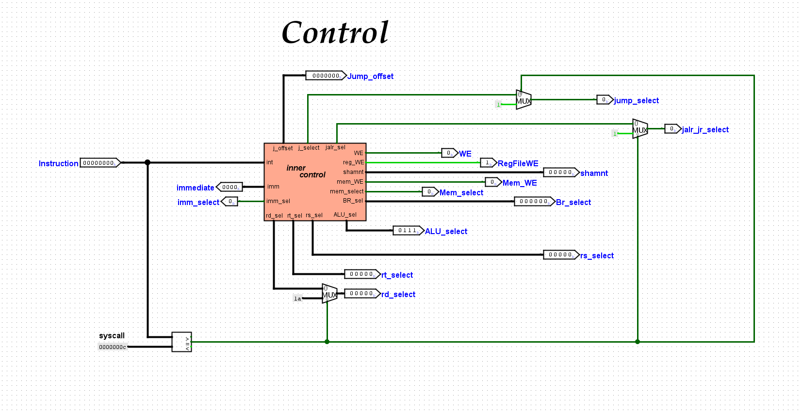
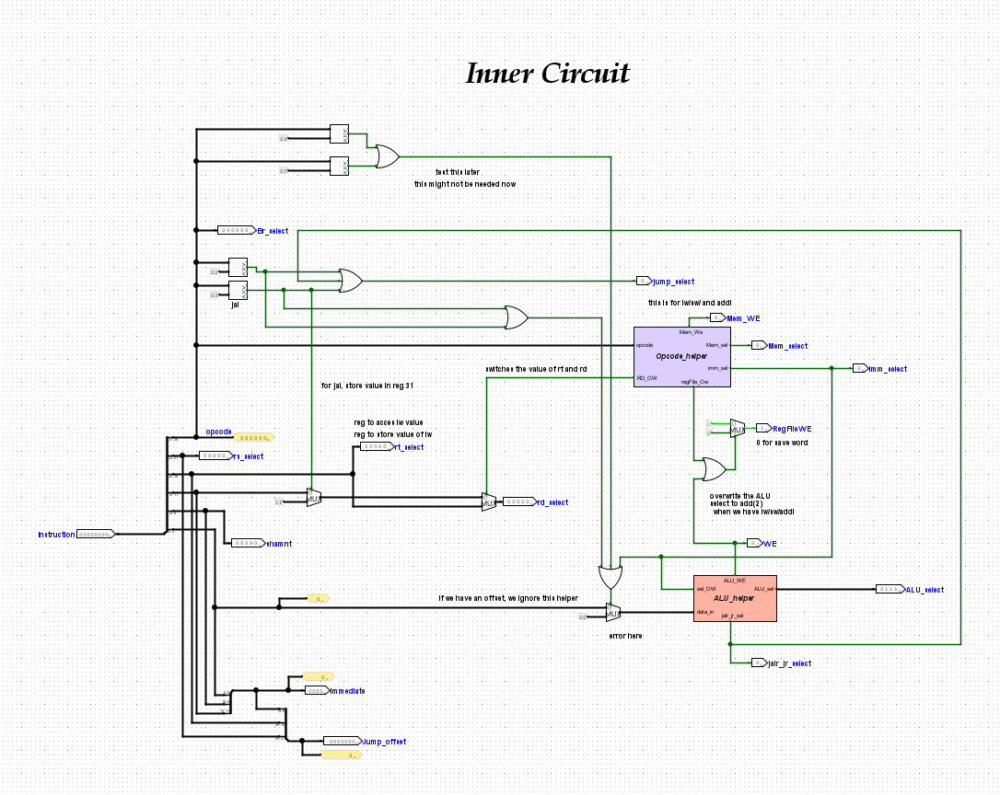
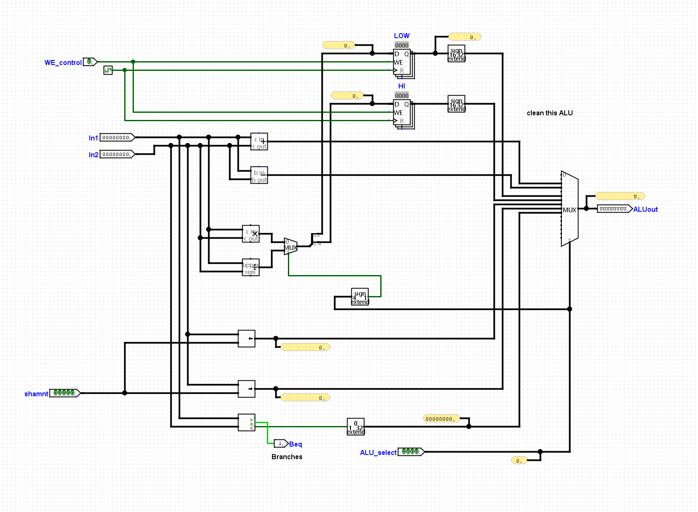
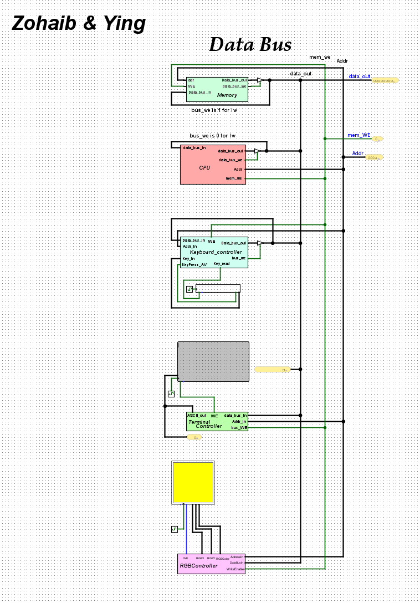

# About
------------------
This project is a comnputer simulation which uses logisim to simulate a working processor and other I/O devices 

This was implemented by Zohaib and Ying.
This is version 1.0.0 of the project.

# Getting Started!
------------------
Use the assemble.exe to convert mips code into binary. 
To execute the code in the command line you must follow the following format:
"./assemble input.asm output.bin"

# Project Design
------------------
## Processor

The processor consists of the control, ALU, and instant-memory. It has both input from and output to the bus, which is connecrted to other I/O devices, such as keyboard and monitor. 

### Regfile
The regfile circuit contains 32 32 bits MIPS registers. It takes in rd, rd select, rs select, rt select, and write enable. The circuit outputs rt and rs values. Rd is the input data value to the regfile and rd select is the register on which to store the data value when write enable is 1. Similarly, rt and rs are data output values, and rt-select an rs-select are the registers from which to retrieve data from

### Control

The control is where all the instuctions are interpreted. Our control circuit contains an inner control circuit, which is where all the actual wiring and logic takes place. Doing this allowed us to easily overwrite the output values when a syscall instution is sent to the control, since syscall works as "Jalr $k0". 

The inner contol itself consists of two helper circuits, Opcode helper and ALU helper. The opcode helper is used for lw/sw/addi. the ALU helper, on the other hand, decided which ALU instuction to select. It takes in the first six bits from the instuction and compare them to MIPS fucc value for each instuction. for example, when the input to ALU helper is 100000, 0x20 in hex, the ALU select will be for the instuction add.

### ALU

 
 The ALU 

## The Data Bus

